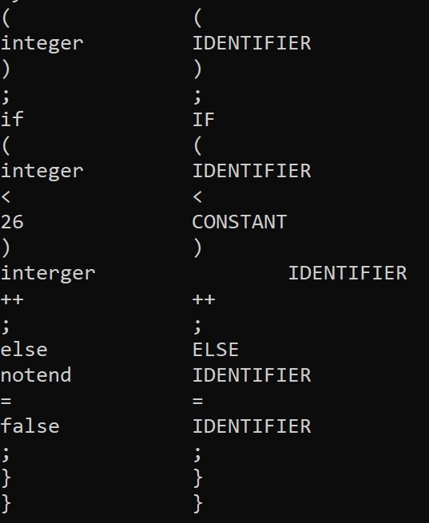

## LEX结构

```c++
class Lex {
public:
	string inFileName;
	string content;
    // 记录定义的变量的正则表达式
	unordered_map<string, string> variables;
    // 记录最终定义的Token以及其完整的正则表达式
	vector<pair<string, string>> tokenRegex;
  	
	DFAPtr dfaP;

	string tarText;
	int ptr = 0;

	Lex(string s);

	// 解析词法文件，获得Token的正则表达式，放入tokenRegex中
	void parseLex();

	// 构造词法解析dfa
	void formDFA();

	// 加载目标文本
	void loadTarget(string fname);
	
    // 词法解析的关键函数，依次给出下一个Token
	Token nextToken(bool& isend);

	// 辅助方法
	bool isIgnore(char ch) {
		return ch == ' ' || ch == '\n' || ch == '\t';
	}
};


```

Lex 类的核心内容：

* 解析Lexical词法文件，在读入词法的过程中，收集需要解析的Token以及其对应的正则表达式
* 通过调用DFA类生成该词法的DFA
* 读入目标解析的文件，将字符单位逐个传入DFA，构建得到Token

需要注意的点：

* 需要将每个Token类型作为非终结符加入全局的符号表中

## DFA结构

```cpp
class DFANode {
public:
	int id;
	string state;
};
class DFAEdge {
public:
	unordered_map<char, int> trans;
};
class DFA {
public:
	vector<DFANodePtr> nodes;
	vector<DFAEdgePtr> edges;
	int idCount = 1;

	DFA(NFAPtr nfaP, unordered_map<string, int>& prio);

	// 返回 state 以 ch 为出边的状态，若无此边则返回 -1
	int next(int state, char ch);

};
```

DFA 类的核心内容：

* 调用NFA类，构建其NFA
* 通过NFA结构生成DFA
* Token构建的单步方法

需要注意的点：

* DFA节点状态中本可能包括多个NFA状态，这里根据优先级（Token在词法文件中的定义位置）选择优先级最高的状态作为节点状态
* edges和nodes一一对应，edges[i]表示nodes[i]的出边，使用哈希表表示各字符到达的下一节点

## NFA结构

```
class NFANode {
public:
	int id;
	string state;
};
class NFAEdge {
public:
	unordered_map<char, set<int>> trans;
	set<int> epsTrans;
};

class NFA {
public:
	NFA();

	vector<NFANodePtr> nodes;
	vector<NFAEdgePtr> edges;

	// 入栈优先级和出栈优先级，使用.作为连接符
	static unordered_map<char, int> priorityin;
	static unordered_map<char, int> priorityout;

	int idCount;

	// 判断是否为操作符
	static bool isop(char ch);

	// 单个正则表达式转NFA
	void formRegular(string re, string state = "");

	// 比较算符优先级，若有符号出栈，则进行算符运算
	void check(stack<char>& op, stack<pair<int, int>>& opn, char o);

	// 求闭包
	void closure(set<int>& s);

	void print();
};
```

NFA 类的核心内容：

* 根据正则表达式生成单个Token的NFA
* 初始节点连接各个正则表达式的NFA
* 使用优先级固定的算符优先分析法，将添加连接符的过程融入了构建NFA的过程中

需要注意的点：

* 同DFA的是，edges和nodes一一对应，edges[i]表示nodes[i]的出边
* 但这里的NFAedge对于同一字符可以有多个出边，所以哈希表构建的是单个字符到节点集合，同时也要记录空边（Epsilon边）


## 样例

对于`(a[b-d])*a?b`

### 正则表达式转 NFA


### NFA 转 DFA


## 词法解析器解析C++程序样例

### 程序

```cpp
char myfunction(int a){
	return a+'0';
}

int main(int arg, char* argv[])
{
	int integer = 0;
	bool notend = true;
	char mystring[10];

	while (notend) {
		mystring[integer] = myfunction(integer);
		if (integer<26) interger++; else notend = false;
	}

}
```

### 解析结果



