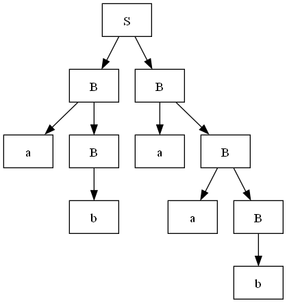
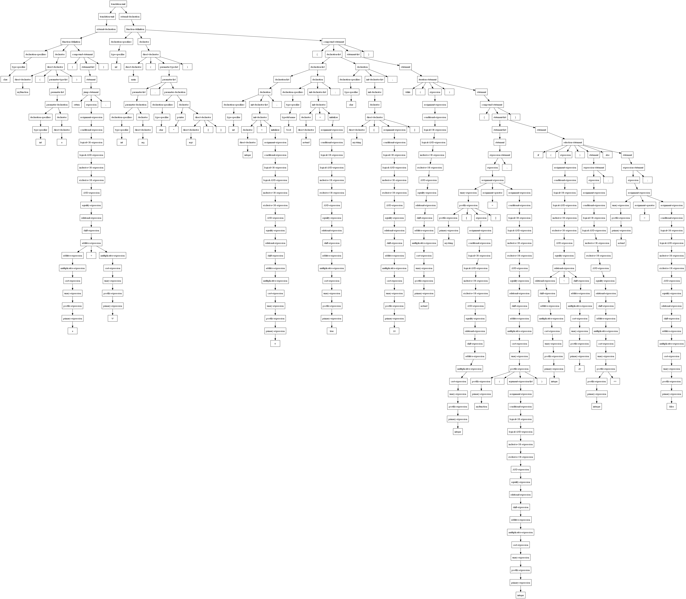

## Parser结构

```cpp
class Node {
public:
	Token token;
	int id;
	vector<int> sons;
	int treeId;

	static int idCount;
	Node(Token t)；
};

class ParseTree {
public:
	vector<NodePtr> tree;
	int count = 1;
	ofstream out;
}

class Parser {
public:
	LexPtr lex;
	YaccPtr yacc;
	ParseTree pt;

	Parser(Lex& l, Yacc& y, string fname);
    void parse();
}
```

核心内容

* 传入`lex`，`yacc`构建解析器
* 解析的过程中构建语法解析树
* 解析完成后通过语法解析树输出解析结果的`dot`文件
* 通过`graphviz`工具解析`dot`文件得到语法解析树结果


## 样例

### 目标解析文法

```
S	: B B
	;

B	: a B
	| b
	;
```

### 目标解析程序

```
abaab
```

### 解析结果



## 最终解析

### 运行说明

由于时间问题，没有编写将词法语法解析结果输出为代码的功能，而是选择直接在解析完成后运行parser，完成对目标代码的解析；

* 通过在main函数中修改lex的构造参数修改词法文件
* 通过在main函数中修改loadTarget的参数修改目标文件
* 通过在main函数中修改yacc的构造参数修改语法文件
* 通过在main函数中修改parser的构造参数修改输出文件
* 通过对输出文件运行`dot -Tpng outfilename.dot -o outpngname.png` 将`dot`语法文件用graphviz解析为图片

### 主程序

```cpp
int main()
{
	cout << "------  start   ------\n";
	Lex lex("TestLexical");
	cout << "--- lex parsing finished ---\n";
	lex.loadTarget("TestCode");
	cout << "--- code loading finished ---\n";
	Yacc yacc("TestGrammar");
	cout << "--- yacc parsing finished ---\n";
	Parser parser(lex, yacc, "outputtest.dot");
	cout << "--- start parsing ---\n\n\n";
	parser.parse();
	cout << "--- end parsing ---\n\n\n";
}
```


### 目标程序

```cpp

char myfunction(int a){
	return a+'0';
}

int main(int arg, char* argv[])
{
	int integer = 0;
	bool notend = true;
	char mystring[10];

	while (notend) {
		mystring[integer] = myfunction(integer);
		if (integer<26) interger++; else notend = false;
	}

}
```

### 解析结果

