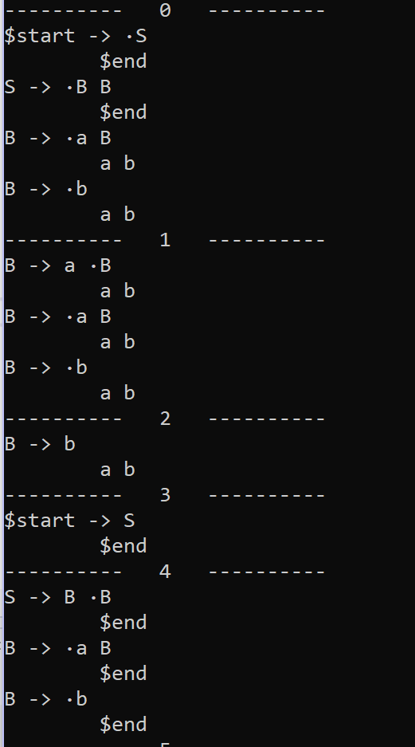
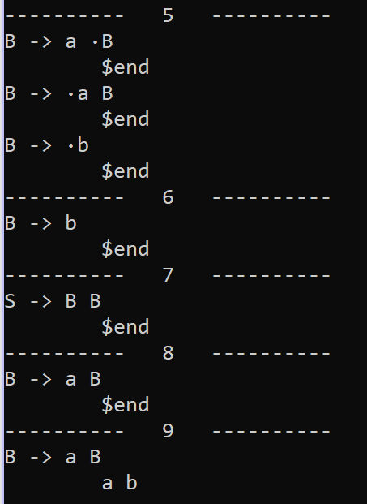
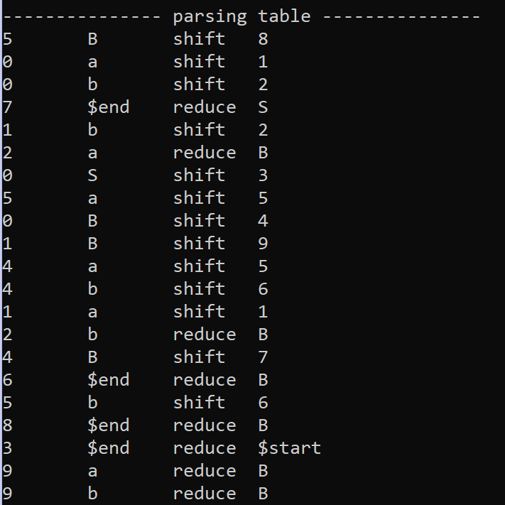
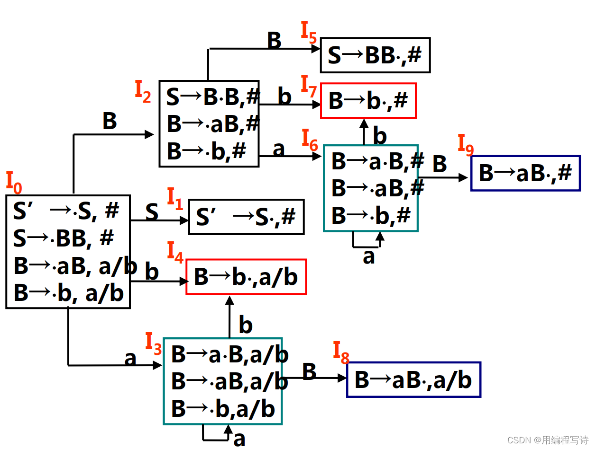
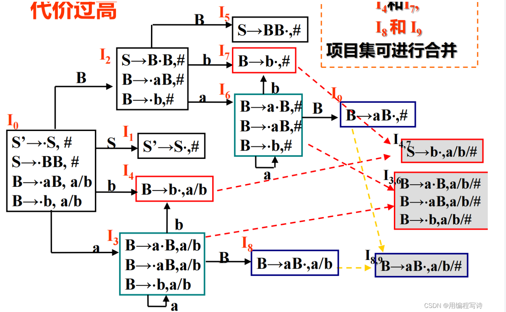

## Yacc结构

```cpp
class Yacc {
public:
	string inFileName;
	string content;
	
	GrammarPtr grammarP;
	LALRParserPtr parser;

	Yacc(string s);

	// 解析语法文件
	void parseGrammar();

	// 辅助方法
	bool isIgnore(char ch) {
		return ch == ' ' || ch == '\n' || ch == '\t';
	}
	bool isCanBeSkip(char ch) {
		return ch == ' ' || ch == '\t';
	}
};
```

核心内容：

* 解析语法文件，将语法文件转为rules放入grammar中
* 在grammar构建完毕后，将其传入LALRParser中，构建语法解析树

需要注意的点：

* 在解析语法文件时，首项产生式的左端即为接受符号
* 解析语法文件时，需要将新出现的符号作为非终结符加入符号表中


## SymbolTable 结构 （全局符号表）

```cpp
class SymbolTable {
private:
	struct Symbol {
		string name;
		bool isTerminal;
	};

public:
	SymbolTable();

	const int startMark = -2;
	const int endMark = -1;

	// symbol 索引 index
	unordered_map<string, int> table;
	// index 索引 symbol
	unordered_map<int, Symbol> rTable;

	// 返回新索引值
	static int newIndex();

	int addSymbol(const string& s, bool terminal);
	bool isTerminal(int index);

	// 重写[]操作符，便于查询符号表
	int operator[](const string& s);
	string operator[](int index);

};
```

核心内容：

* 用于记录`SymbolTable`
* 将符号的字符串转换为数字，便于后续语法分析的操作和存储
* 通过重写`[]`操作符，便于查询符号表


## Rule 结构

```cpp
class Rule {
public:
	Rule(symbol s) :origin(s) {}

	int origin;
	vector<vector<int>> expansions;

	// 判断这条规则是否为ε规则
	bool isEps() const;

	// 产生式后附加符号
	void append(int i, int s);
	// 添加产生式 返回新增产生式索引
	int addExpansion();

	void print();
	void print(int index, int dot);
};
```

核心内容：

* 用于记录文法中的每一条产生式规则
* 同样左端的产生式会被放入一组`Rule`中


## Grammar 结构

```cpp
class Grammar {
public:
	Grammar(symbol s);

	int start;							// 文法开始符号
	unordered_map<symbol, setPtr> first;		// 记录first集合
	unordered_map<symbol, setPtr> follow;		// 记录follow集合
	setPtr allNSymbols;			// 记录所有非终结符
	setPtr nullSet;			// 记录可以为空的非终结符的集合
	vector<rulePtr> rules;				// 记录产生式

	unordered_map<int, int> ruleIndexMap;	// 左符号到产生式的索引，便于查找产生式

	// 添加产生式
	void addRule(const rulePtr& r);

	// 计算First、Follow集合
	void calculate();

	// 判断符号s当前是否可以为空
	bool ifEps(symbol s);

	// 将s插入t 若发生改变则返回true
	static bool updateSet(setPtr t, setPtr s);
	static bool updateSet(setPtr t, symbol s);

	void ruleIndex(int i, int j);
	int ruleIndex(int i);

	void printSets();
	void printRules();
};
```

核心内容：

* 用于存储文法
* 包含一组`Rule`，每个`Rule`代表一组相同左端的产生式
* 包括计算First集和Follow集的方法
* 包括一个用于记录First中可以为空的非终结符集合
* 可以通过`ruleIndexMap`记录`rule`左端与`rules`数组索引之间的对应关系，提供`ruleIndex`方法进行记录和查询操作

#### 计算First & Follow 集

* 先使用不动点法计算First集
  * 对 $S\rightarrow \alpha$ 且 $\epsilon \in First(\alpha)$ 有 $\epsilon \in First(S)$
  * 对 $S\rightarrow \alpha \beta$ 且 $\epsilon \in First(\alpha)$ 有 $First(\beta) \subseteq First(S)$
* 每次单轮循环中，设置`isChanged`标记，如果集合发生变化，则将其置为`True`，直到一轮循环得到的结果为`False`
* 再使用相似的方法计算Follow集
  * 对 $S\rightarrow \alpha B \beta$ 有 $First(\beta) \subseteq Follow(B)$
  * 对 $S\rightarrow \alpha B \beta$ 且 $\epsilon \in First(\beta)$ 有 $Follow(S) \subseteq Follow(B)$


## parsingTable 结构

```cpp
enum action { shift, reduce };
struct Action {
	action act;
	// 如果是移进 则state表示移进目标项集id 如果是规约 则rIndex eIndex表示规约的rule
	int state;

	int rIndex;
	int eIndex;

	Action();
	Action(action a, int s, int r, int e);
	Action(const Action& a);
};
class ParsingTable {
public:
	ParsingTable() {}

	// Set id 状态下 接受 symbol 查询 Action
	unordered_map<pair<int, symbol>, Action, PairHash> table;
	
	bool insertAction(int i, symbol s, Action a);

	bool insertAction(int i, set<symbol> s, Action a);

	Action next(int i, symbol s);

	void print();
};
```

核心内容：

* 使用`Action`结构体表示动作，其中`rIndex`，`eIndex`分别表示该动作发生的产生式所属`rule`的两处索引
* 在`parsingTable`中，使用哈希表，通过`pair<int, symbol>`也就是所处状态以及当前符号查询所需要执行的操作
* 提供向`parsingTable`插入`Action`的方法
* 提供查询返回`Action`的方法


## LALRParser

```cpp
class Item {
public:
	Item(rulePtr r, int i, int d, GrammarPtr p) :rp(r), index(i), dot(d), grammarP(p) {}

	GrammarPtr grammarP;			// 所属文法
	rulePtr rp;						// 产生式
	int index;						// 在rule中的索引
	int dot;						// 当前dot标识位置
	set<symbol> successors;			// 后继符号

	// 返回dot后下一个符号，约定-3为可规约
	symbol next();

	// 计算后继符号集
	void succ(set<symbol>& se);

	bool addSuc(symbol s);
	bool addSuc(set<symbol>& s);
	
	bool operator==(const Item& ip) const;

	void print();
};

class ItemSet {
public:
	ItemSet(ItemPtr i, GrammarPtr p, int n)；
	ItemSet(GrammarPtr p, int i)；

	GrammarPtr grammarP;			// 所属文法
	vector<ItemPtr> items;			// 项集
	set<tuple<int, int, int>> id;
	int Id;

	// 拓展完整
	void expand();

	void addItem(rulePtr r, int i, int d, set<symbol>& s);

	void addSuc(int i, symbol s);
	void addSuc(int i, set<symbol>& s);

	void print();
};

class LALRParser {
public:
	LALRParser() {}
	LALRParser(GrammarPtr gp);
	
	GrammarPtr grammarP;
	vector<ItemSetPtr> itemSets;	// 所有项集

	ParsingTable pt;

	// 将每个ItemSet 的 id 映射到 itemSets 的索引上
	unordered_map<set<tuple<int, int, int>>, set<int>, SetTupleHash> idMap;

	// 生成语法分析表
	void computeParsingTable();
	void print();
	void printParsingTable();

};

```

核心内容：

* 通过文法grammar使用LALR(1) 解析并构建出语法解析表
* `ItemSet`即项集，表示一个解析状态，其中包括多个`Item`项
* 每个`Item`即代表一条产生式以及其解析到的位置
* 因此一条`Item`需要记录的有
  * 指向`Rule`的指针
  * 在一组`Rule`中的索引
  * 在一条产生式中分析到的位置（即 **·** 所在位置）
  * 其后继符号集
* `LALRParser`中需要记录所有的项集

需要注意的点：

* 为了判断一个状态是否已经存在，这里使用了`Id`表示一个项集在所有项集中的索引，使用`id`作为一个项集的唯一表示符号，其实质为一个`set<tuple<int, int, int>>` 代表这条项集的所有`Item`的`<ruleIndex, expansionIndex, dot`，并通过在`LALRParser`中使用一个哈希表，将其映射到每个`itemSet`的`Id`（即索引）上

### 生成语法解析树

* 创建初始项集，在创建每个项集时，创建项集的唯一标识，用于确定是否为已存在项集
* 使用待处理栈记录还需要进行解析的项集索引，当栈为空时，则解析完毕
* 没生成一组项集则对其进行拓展，判断其是否存在，若已存在，则只需移进，否则需要视作新的状态
* 循环中，每次取出一条待处理项集
  * 检查其规约情况
    * 如果某项的`dot`到了项尾，则向语法解析表中加入规约动作
  * 检查其移进情况
    * 如果某项的`dot`后存在符号，则可以对其进行移进
    * 得到移进后的初始项集，并进行拓展得到完整项集
    * 检查是否为新的项集
    * 已存在则直接移进
    * 未存在则加入待处理项集，记录移进

### 将产生式项集扩展完整

* 使用待处理栈记录可以进行拓展的产生式
* 使用哈希表记录每条`Item`是否已经加入了该项集
* 向其加入所有的初始产生式
* 每次取出一条待处理产生式
* 若`dot`后为非终结符，则可将其展开为新的产生式项
* 检查以其为左端的所有产生式，若未存在则作为新的项加入项集
* 同时加入待处理栈中
* 过程中注意处理后继符号集间的关系

## 样例

### 测试文法

```
S	: B B
	;

B	: a B
	| b
	;

```

### LALR解析结果





### 语法解析表




### 对比手写解析



